# A Spectral Element Method for Fluid Dynamics: Laminar Flow in a Channel Expansion

**Anthony T. Patera**

Department of Mechanical Engineering, Massachusetts Institute of Technology, Cambridge, Massachusetts 02139

*Received March 29, 1983; revised October 4, 1983*

*Journal of Computational Physics* **54**, 468–488 (1984)

---

## Abstract

A spectral element method that combines the generality of the finite element method with the accuracy of spectral techniques is proposed for the numerical solution of the incompressible Navier–Stokes equations. In the spectral element discretization, the computational domain is broken into a series of elements, and the velocity in each element is represented as a high-order Lagrangian interpolant through Chebyshev collocation points. The hyperbolic piece of the governing equations is then treated with an explicit collocation scheme, while the pressure and viscous contributions are treated implicitly with a projection operator derived from a variational principle. The implementation of the technique is demonstrated on a one-dimensional inflow–outflow advection–diffusion equation, and the method is then applied to laminar two-dimensional (separated) flow in a channel expansion. Comparisons are made with experiment and previous numerical work.

---

## Introduction

Much attention has been devoted in the past several decades to the development of efficient, accurate, and stable numerical schemes for the solution of the (incompressible) Navier–Stokes equations,

```
                               dv   lap(v)
                 v . grad(v) + ── = ────── - grad(p)
                               dt     R
                              div(v) = 0
```
*(1)*

Three classes of solution techniques have emerged: the finite difference techniques, the finite element methods, and the spectral techniques. Although the finite element and spectral methods are in fact related, practitioners of the two methods have not, in general, exploited this similarity. In this paper we present a hybrid finite-element–spectral method that combines the generality of the former with the accuracy of the latter in a more flexible ratio than is found in either technique alone.

Spectral methods [1] involve the expansion of the solution to a differential equation in a high-order orthogonal expansion, the coefficients of which are determined by a weighted-residual projection technique. The schemes are "infinite"-order accurate if the expansion functions are properly chosen.

The finite element procedure is, in the most general sense, a weighted-residual technique applied to a series of expansions, each with support over only a small region of space (an "element"). When the weighted-residual technique is directly derived from an associated variational principle, continuity of natural boundary conditions is implicitly satisfied at element boundaries as part of the convergence process.

The similarity between finite element and spectral methods is, in some cases, exact. For instance, in the case of the Laplacian operator, the one-element variational finite element approximation (in fact, a Rayleigh–Ritz procedure) is exactly equivalent in the interior of the domain to a Galerkin spectral approximation if the basis functions are the same. The main attraction of spectral techniques is accuracy; general, complex flow problems are typically extremely difficult to implement and solve using spectral methods. The main attraction of the finite element method is generality; elements are typically chosen to be at most quadratic [2–4], and consequently, great accuracy is only achieved with difficulty.

Global domain-decomposition techniques have been introduced previously in computational fluid dynamics, both in terms of low-order finite element expansions (the "domain decomposition" technique [5]) and spectral methods (the "multi-domain spectral method" [6]). A "global element method" has also been introduced for elliptic equations [7–10], although it has not yet been implemented for the Navier–Stokes equations. The difference between these techniques and the current spectral element method is primarily in the treatment of the continuity conditions at element boundaries, as will be discussed in greater detail in the context of a one-dimensional Poisson equation in Subsection 1.3.

There are two parts to this paper. In Section 1, we solve a one-dimensional inflow–outflow advection–diffusion equation; this model problem accurately mimics the complicated Navier–Stokes equation in that a time step can be separated into an explicit hyperbolic piece and an implicit parabolic piece, yet it is sufficiently simple to allow a clear demonstration of the attributes and implementation of the spectral element technique. Furthermore, the inflow–outflow geometry is an example of an extremely simple situation where spectral techniques already provide poor resolution properties. In Subsection 1.1, we indicate the spatial discretization basic to the spectral element method. In Subsection 1.2, the technique is applied to a first-order wave equation. In Subsection 1.3, the method is applied to a Poisson equation, and the results are compared with those obtained using either a full spectral technique or a quadratic finite element procedure. In Subsection 1.4, we assemble the results of the previous sections to solve the one-dimensional inflow–outflow advection–diffusion equation.

Although the one-dimensional advection–diffusion equation is illustrative, the true test of the method must be in a multi-dimensional, nonlinear, "complex" flow situation. Therefore, in Section 2 of this paper, we simulate laminar flow in a one-sided channel expansion. In Subsection 2.1 the back-step geometry is described, and the modifications required to extend the methods of Section 1 to include pressure, nonlinear, and multi-dimensional effects are discussed. In Subsection 2.2 we present the results of our simulations and comparisons are made with experiment and previous numerical work. Extensions and improvements to the spectral element method which will allow it to be used in greater generality than currently possible are briefly discussed.

---

## 1. The Inflow–Outflow Advection–Diffusion Equation

### 1.1. Spatial Discretization

Our model problem is the one-dimensional advection–diffusion equation,

```
                           du   du      d u
                           ── + ── = nu ───
                           dx   dt        2
                                        dx
```
$-\infty < x < \infty.$ &emsp; *(2)*

Using a second-order Adams–Bashforth explicit scheme for the wave operator and the Crank–Nicolson method for the diffusion term, the time-discretized form of (2) at time step $n$ is

```
                    uH      - u    ux        3 ux
                      n + 1    n     n - 1       n
                    ──────────── = ─────── - ─────
                         dt           2        2
```
*(3a)*

```
               u      - uH        (uxx      + uxx ) nu
                n + 1     n + 1       n + 1      n
               ──────────────── = ────────────────────
                      dt                   2
```
*(3b)*

We remark briefly here on the similarity between the above model problem and the Navier–Stokes equations. If the nonlinear (advective) terms are treated explicitly, the full solution of the Navier–Stokes equations at each time step involves a wave-like equation similar to (3a), a Poisson equation for the pressure, and a Helmholtz equation (for the viscous terms) similar to (3b). Although the pressure and the viscous calculations may be coupled (depending on the time-stepping scheme used for the Stokes problem, see Section 2), the individual equations to be solved in a given time step are all represented in Eq. (3).

We now discuss the spatial discretization of (2) by the spectral element method. The domain is broken up into $M$ "elements," the $i$th element being of length $L^i$ and defined on the interval $[a^i, b^i]$. Within the $i$th element we represent the function $u(x)$ as the Lagrangian interpolant through the $N_x^i + 1$ points

```
                                     %pi j
                           xb  = cos(─────)
                             j         N
```
$j = 0, 1, 2, \ldots, N.$ &emsp; *(4a)*

where the overbar indicates the local element coordinate system given by

```
                               2 (x - a)
                          xb = ───────── - 1
                                   L
```
*(4b)*

The interpolant of $u(x)$ in the $i$th element is written as

```
                                 N
                                ____
                                ╲
                        u (x) =  ⟩    u  h (x)
                         i      ╱      j  j
                                ‾‾‾‾
                                j = 0
```
*(5a)*

where the $h_j$ are identically zero outside the $i$th element, and are Lagrangian interpolants satisfying

```
                         h (xb ) = delta
                          j   k         j, k
```
*(5b)*

within the element. (Here $\delta_{jk}$ is the Kronecker-delta symbol.) Given the special collocation points (4a), the interpolation functions $h_j(\bar x)$ can be expressed as

```
                               N
                              ____  T (xb ) T (xb)
                              ╲      n   j   n
                            2  ⟩    ──────────────
                              ╱           c
                              ‾‾‾‾         n
                              n = 0
                   h (xb) = ──────────────────────
                    j                N c
                                        j
```
*(5c)*

where the $T_n$ are the Chebyshev polynomials defined as

```
                    T (cos(theta)) = cos(n theta)
                     n
```
*(6a)*

and

$\bar c_k = 1$ for $k \ne 0, N$; &nbsp; $\bar c_k = 2$ for $k = 0, N$. &emsp; *(6b)*

The purpose for choosing the particular collocation points (4a) for the Lagrangian interpolant $u^i$ is that

```
                                          1
                          norm(u - u ) <= ──
                                    i      k
                                          N
```
as $N \to \infty$, for all $k$. &emsp; *(7)*

(for $u \in C^\infty$ and any suitable norm), as can be easily demonstrated by Sturm–Liouville theory or the properties of cosine representation. (Here $C^p$ is the space of functions that are continuous and have continuous derivatives up to order $p$.) Other choices of collocation points have the property (7); however, (4a) seems a reasonable choice given the good approximation properties of Chebyshev polynomials as well as the existence of a fast transform.

Using the spatial discretization described, we now indicate the projection operators used to form the right-hand sides of (3). Rather than dealing directly with the advection–diffusion equation, we first look at even simpler sub-problems, namely a wave equation and a Poisson equation analogous to (3a) and (3b), respectively.

### 1.2. The Wave Equation

We look at the simple one-dimensional wave equation

```
                             du   du
                             ── + ── = 0
                             dx   dt
```
$-1 < x < 1$ &emsp; *(8a)*

```
                        u(- 1, t) = sin(%pi t)
```
*(8b)*

```
                             u(x, 0) = 0
```
*(8c)*

which has the solution

$$
u(x, t) = \sin \pi(t - x - 1), \quad x < t - 1; \qquad u(x,t) = 0, \quad x > t - 1. \tag{9}
$$

Note for $t < 2$, $u_x$ is discontinuous. A problem similar to this is studied in detail in [1] for a "one-element" spectral method, and it is indicated that the Chebyshev representation allows for patching of domains with no further conditions than physically required. We demonstrate how this is done using the (physical-space) representation described in Subsection 1.1 and a collocation projection operator (the only viable projection operator for the nonlinear terms in the Navier–Stokes equations if high-order methods are used).

Discretizing in time, (8) becomes at time $t^{n+1}$,

```
                    u      - u    ux        3 ux
                     n + 1    n     n - 1       n
                    ─────────── = ─────── - ─────
                        dt           2        2
```
*(10a)*

```
                    u     (- 1) = sin(%pi t     )
                     n + 1                 n + 1
```
*(10b)*

The domain is broken into two elements, the first covering $[-1, 0]$, the second $[0, 1]$. In each element the derivatives are calculated using collocation [1], either using a transform-recursion technique or by direct matrix multiplication. The only subtlety involves updating $u$ at the domain and element boundaries. With respect to the former, the correct treatment is to simply set the node at $x = -1$ according to (10b), with no boundary condition required at outflow ($x = 1$). As to element boundaries, a family of schemes exists. In particular, derivatives at the element interface ($x = 0$) can be evaluated as weighted averages

```
                       D  = D     ap + D     am
                        0    0, p       0, m
```
$\alpha^- + \alpha^+ = 1$, with `am` = $\alpha^-$, `ap` = $\alpha^+$. &emsp; *(11)*

where $D_{0^-}, D_{0^+}$ denote the derivatives at $x = 0$ evaluated in the $[-1, 0]$ and $[0, 1]$ elements, respectively.

Clearly the best choice in (11) consistent with the characteristics of (8) is $\alpha^- = 1$, $\alpha^+ = 0$. This choice corresponds to "spectral upwinding," and is certainly stable. In Fig. 1, we plot the $L_2$-error in $u(x)$ (using "upwinding") at a time $t = 5.0$ as a function of the total number of points in the domain, $N_t = 2N_x^1 + 1$ ($N_x^1 = N_x^2$). As expected, the errors decrease at least exponentially. The choice of $\alpha^- = \alpha^+ = \tfrac{1}{2}$ (which is what the formal collocation procedure would give) has obvious advantages in terms of ease of implementation. Numerical tests indicate that this combination does not, in fact, significantly affect the stability of the scheme.

We have demonstrated the ease with which Chebyshev collocation extends to multi-element problems; there is no need for patching beyond that required by the equation. For first-order hyperbolic systems such as (8) (and, in fact, the advective piece of the Navier–Stokes equations) only continuity of the function is required, and that is easily satisfied in the physical-space representation of the spectral element method. Empirical investigation has indicated that nonuniform spacing of points between elements (e.g., $N_x^1 \ne N_x^2$) has no significant effect on accuracy, as pointed out in [1].

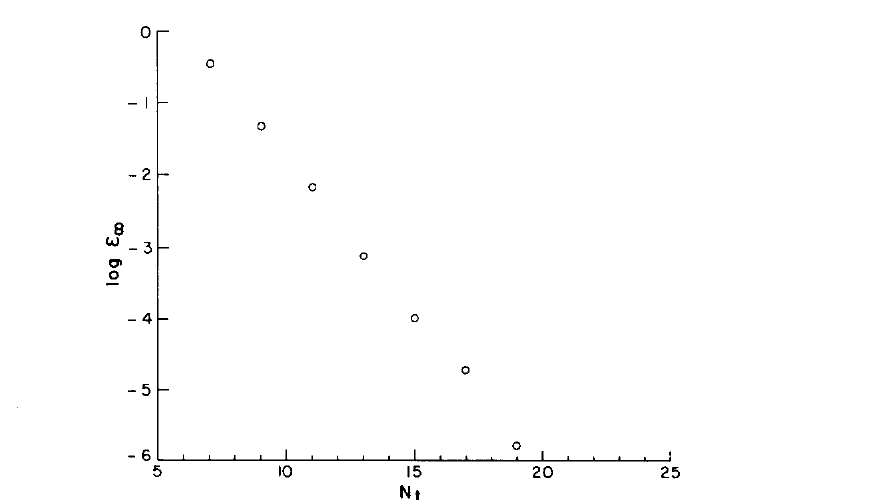

**Fig. 1.** A plot of the (spatial) error in the numerical solution to (8) obtained using the spectral element method on a two-element ($[-1, 0]$, $[0, 1]$) grid. Here $E_\infty = \|u_{\text{numerical}} - u_{\text{exact}}\|_\infty$, and $N_t$ is the total number of grid points (nodes) used.

### 1.3. The Helmholtz Equation

We present here the solution of

```
                          2
                         d u           2
                         ─── - u lambda  = f
                           2
                         dx
```
$-1 < x < 1$ &emsp; *(12a)*

```
                        [u(- 1) = 0, u(1) = 0]
```
*(12b)*

using the spectral element discretization. It is here that the influence of both spectral methods and finite element techniques becomes apparent.

To construct the spectral element approximation we need the variational principle equivalent to the solution of (12), namely, maximization of the functional

```
                                  M
                                 ____
                                 ╲
                             I =  ⟩    I
                                 ╱      i
                                 ‾‾‾‾
                                 i = 1

                     b                  du 2
                    ⌠      2       2   (──)
                    ⎮     u  lambda     dx
               I  = ⎮  (- ────────── - ───── - f u) dx
                i   ⎮         2          2
                    ⌡
                     a
```
*(13)*

where $I^i$ is the contribution to $I$ from the $i$th element. In particular, we use the Lagrangian interpolant $u^i(x)$ as a trial function in (13), and require that the variation of $I^i$ with respect to the nodal values $u_j^i$ vanish. The elemental equations are then

```
                         C     u  = B     f
                          j, k  k    j, k  k
```
*(14a)*

(we use the repeated-index summation convention for subscripts only), where

```
                                                2
                    C     = A     - B     lambda
                     j, k    j, k    j, k
```
*(14b)*

and $A_{jk}^i$ and $B_{jk}^i$ follow from (5), (6), and (13):

```
                                      N
                                     ____  T (xb ) a
                                     ╲      m   k   n, m
                             T (xb )  ⟩    ─────────────
                        N     n   j  ╱          cb
                       ____          ‾‾‾‾         m
                       ╲             m = 0
                     8  ⟩    ───────────────────────────
                       ╱                 cb
                       ‾‾‾‾                n
                       n = 0
             A     = ───────────────────────────────────
              j, k                 2
                                L N  cb  cb
                                       j   k
```
*(15a)*

```
                                       N
                                      ____  T (xb ) b
                                      ╲      m   k   n, m
                              T (xb )  ⟩    ─────────────
                         N     n   j  ╱          cb
                        ____          ‾‾‾‾         m
                        ╲             m = 0
                    2 L  ⟩    ───────────────────────────
                        ╱                 cb
                        ‾‾‾‾                n
                        n = 0
            B     = ─────────────────────────────────────
             j, k                 2
                                 N  cb  cb
                                      j   k
```
*(15b)*

Here

$a_{nm} = \int_{-1}^{1} (dT_n/dx)(dT_m/dx)\,dx = 0$ for $n+m$ odd; for $n+m$ even:

```
                        J      v      - v      J
                         n - m  n + m    n - m  n + m
                a     = ─────────────────────────────
                 n, m                 2
```
*(16a)*

where

```
                                 inf
                                 ____
                                 ╲        1
                        J  = - 4  ⟩    ───────
                         k       ╱     2 p - 1
                                 ‾‾‾‾
                                 p = 1
```
$k \ge 1$; $J_0 = 0$. &emsp; *(16b)*

Also, $b_{nm} = \int_{-1}^{1} T_n T_m\, dx = 0$ for $n+m$ odd; for $n+m$ even:

```
                              1              1
                 b     = ──────────── + ────────────
                  n, m              2              2
                         1 - (n + m)    1 - (n - m)
```
*(17)*

To construct the system matrix from the element matrices the "direct stiffness" method [4] is used, which recognizes that the variation in $I$ due to an element boundary node "displacement" is simply the sum of its contributions from each element it bounds. Denoting direct stiffness summation by $\sum'$, the spectral element approximation to (12) can then be written as

```
                         C     u  = B     f
                          p, q  q    p, q  q
```
*(18a)*

```
                     M                       M
                    ____                    ____
                    ╲                       ╲
           [C     =  ⟩    C       , B     =  ⟩    B       ]
             p, q   ╱      i, j, k   p, q   ╱      i, j, k
                    ‾‾‾‾                    ‾‾‾‾
                    i = 1                   i = 1
```
*(18b)*

and $u_q$, $f_q$ are defined in terms of the "global" node numbering. Note that no patching is required across element boundaries to ensure continuity of $u_x$, as the projection (18) has been derived from the variational principle (13). The (essential) Dirichlet boundary conditions (12b) are imposed by matrix condensation; the rows and columns corresponding to boundary points are eliminated from the system matrix. Nonzero Neumann boundary conditions would be imposed by modifying the functional (13), while zero-derivative conditions are naturally imposed.

We discuss here the differences between the spectral element, multi-domain [6], and global element [7–10] procedures for solving elliptic problems. All use Chebyshev expansions local to a given element. As indicated above, the spectral element method uses a variational formulation with trial functions that are $C^0$ across element boundaries, with flux continuity at element interfaces satisfied as part of the convergence process. The multi-domain spectral method [6] does not use a variational formulation or $C^0$ basis functions and, as a result, the function and derivative continuity conditions must be separately imposed. The global element implementation is similar to the spectral element procedure in that a variational procedure is used. However, in the global element method, the elements are non-conforming (i.e., the trial functions are not $C^0$ across element boundaries), and a modified functional is used to ensure approximate continuity of the derivative and function. It is our contention that techniques that automatically and self-consistently generate the element continuity conditions (e.g., the global element and spectral element methods) offer significant advantages in terms of ease of implementation over other approaches.

We demonstrate the accuracy of the spectral element method for (12) choosing $\lambda^2 = 0$, $f = \cos(\pi x + \pi/4)$. In Fig. 2 we plot the $L_\infty$-error in the solution as a function of $N_t$ using a one-element spectral method, a two-element spectral element method, and a quadratic finite element method. The spectral method is, of course, the most accurate. However, at an error of $10^{-7}$, the two-element spectral element method requires only about 5 more points than the fully spectral approximation, whereas with the quadratic finite element approximation this accuracy is practically unattainable. If $f$ were such that the solution to (12) varied significantly near $x = 0$ and was smooth near the boundaries, the spectral element method would, in fact, be superior to the one-element spectral representation [10].

Thus it is seen that the spectral element method can achieve the accuracy of a global spectral expansion, however not at the expense of "uncontrollable" resolution. Furthermore, the matrices in (18) are negative-definite symmetric and banded (the bandwidth determined by the $N_x^i$), and the problem of patching is nonexistent.

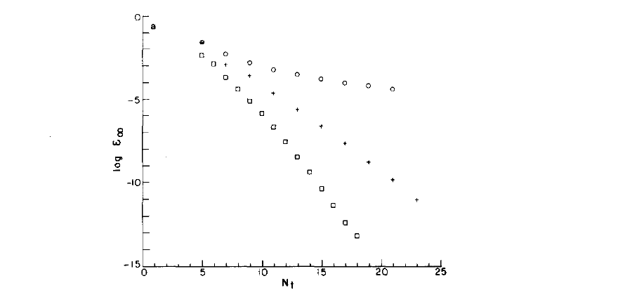

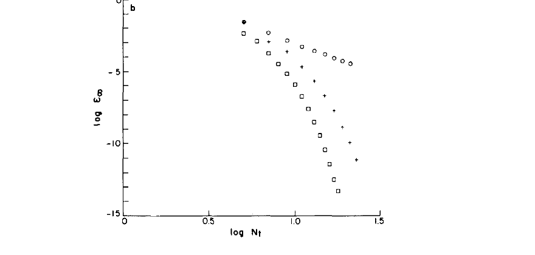

**Fig. 2.** Two plots of the $L_\infty$-error in the numerical solution to the Poisson equation (12) (with $\lambda^2 = 0$, $f = \cos(\pi x + \pi/4)$) obtained using a one-element spectral method ($\square$), a two-element spectral element method ($+$), and a quadratic finite element method ($\circ$). As expected, the spectral and spectral element methods converge exponentially, while the finite element method converges algebraically.

### 1.4. The Advection–Diffusion Equation

We now return to the model problem of Subsection 1.1. The inflow–outflow advection–diffusion equation of interest is

```
                                         2
                           du   du      d u
                           ── + ── = nu ───
                           dx   dt        2
                                        dx
```
$-\infty < x < \infty$ &emsp; *(19a)*

with initial condition

```
                                           2
                                      - 2 x
                          u(x, 0) = %e
```
*(19b)*

The solution to (19) (requiring $u \to 0$ as $|x| \to \infty$) is

```
                                              2
                                     2 (x - t)
                                   - ──────────
                                     8 nu t + 1
                                 %e
                      u(x, t) = ────────────────
                                sqrt(8 nu t + 1)
```
*(20)*

The time discretization is as given in (3). To eliminate the infinite domain we must truncate at finite $x$ and impose proper inflow–outflow boundary conditions. Denoting inflow and outflow as $x_I$, $x_O$, respectively, we use

```
                                         du
              [u(xI, t) = uexact(xI, t), ──(xO, t) = 0]
                                         dx
```
*(21)*

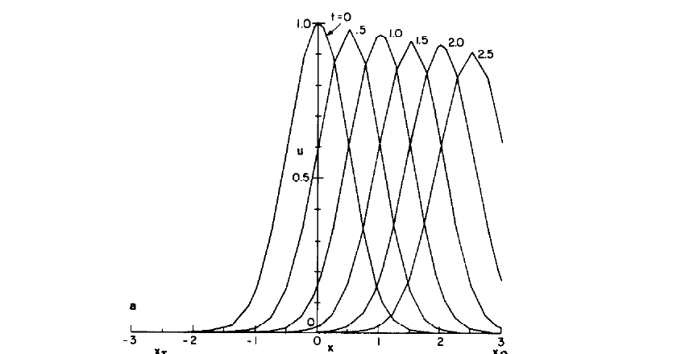

**Fig. 3a.** A plot of the numerical solution to the inflow–outflow advection–diffusion equation (19). Five spectral elements, each containing seven collocation points, are used to resolve the domain $x_I = -2.5 \le x \le 3.0 = x_O$. Note that the gradient at outflow is not exactly zero as the zero-derivative condition is "naturally" imposed.

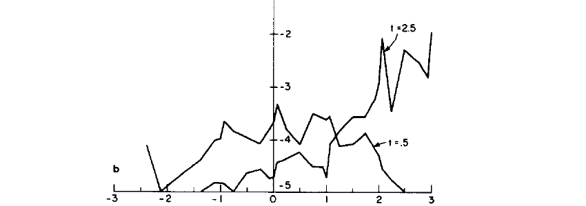

**Fig. 3b.** A plot of the error in the numerical solution to the inflow–outflow advection–diffusion equation (19) at two times, $t = 0.5$ and $t = 2.5$. Here $E = |u_{\text{numerical}} - u_{\text{exact}}|$. Note the very good accuracy achieved, even at late times when the solution is propagating out of the computational domain.

For this particular equation (19), the problematic downstream condition does not in fact appreciably influence the solution upstream when $\nu$ is small, and we therefore consider this case.

The solution to the wave equation (3a) and Helmholtz equation (3b) follows directly from the algorithms presented in Subsections 1.2 and 1.3. For the wave equation, only the inflow boundary condition is imposed. For the diffusive part, the Neumann rather than Dirichlet condition at outflow is "naturally" imposed if no matrix condensation is performed at outflow.

To demonstrate the accuracy of the technique, we solve (19) with $\nu = 0.01$ on the interval $x_I = -2.5$, $x_O = 3.0$ over the time interval $0 \le t \le 2.5$. Five elements are used ($M = 5$), with $N_x^i = 6$ for all elements (i.e., $N_t = 31$); the element domains are $[-2.5, -1]$, $[-1, 0]$, $[0, 1]$, $[1, 2]$, $[2, 3]$. The time step is taken to be $\Delta t = 0.01$. The numerical solution is plotted in Fig. 3a, and in Fig. 3b the error is plotted at two times, $t = 0.5$ and $t = 2.5$. Note the good accuracy with relatively few points.

In Figs. 4a and 4b we present the solution and error, respectively, to this advection–diffusion equation using linear elements (i.e., second-order) with $N_t = 31$. There are significant dispersion errors as evidenced by the wiggles out the back of the wave. Note this is meant to demonstrate accuracy, not efficiency, as for this simple problem a much larger number of linear elements could certainly be used while still keeping the computational work under that required by the spectral element method. Note also that if one used implicit techniques, the finite element Crank–Nicolson formulation (compact scheme) would greatly reduce the dispersion errors [4].

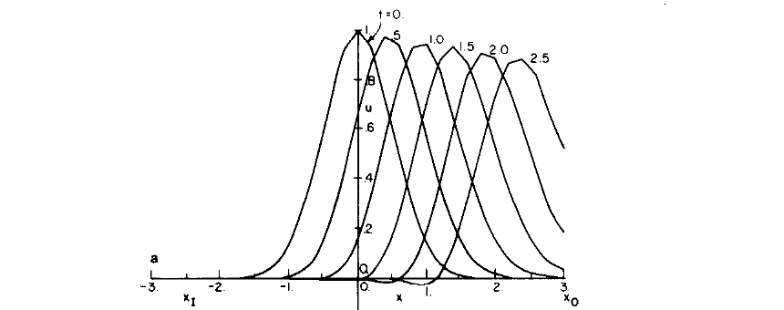

**Fig. 4a.** A plot of the numerical solution to the inflow–outflow advection–diffusion equation (19) using linear finite elements with $N_t = 31$. Dispersion errors can be seen as wiggles behind the travelling wave.

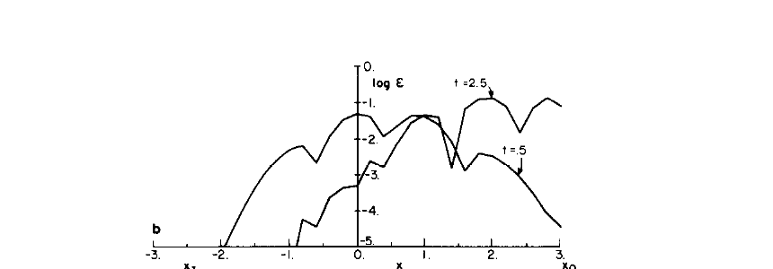

**Fig. 4b.** A plot of the error in the linear finite element numerical solution to the advection–diffusion equation (19) at two times, $t = 0.5$ and $t = 2.5$. As expected, for the same number of points, the spectral element method is several orders-of-magnitude more accurate than the low-order finite element technique.

The inflow–outflow problem is a simple example of when spectral techniques cannot adapt well; nonperiodicity requires a polynomial expansion, which in turn specifies a point distribution not well-suited for the problem (e.g., clustering at inflow and outflow). This poor distribution results not only in wasted resolution, but also in overly restrictive time-step stability conditions. As the geometry becomes complex, spectral methods become increasingly inappropriate and cumbersome. The spectral element method presented here gives a degree of freedom to the distribution of points that allows the method to be tailored to any individual situation.

Although the results of this section are encouraging, they do not address many questions which only arise when considering a real flow situation in a complex geometry, such as treatment of the pressure, nonlinear stability characteristics, numerical conditioning, efficiency, and ease of implementation. For that reason, we now turn to the problem of laminar flow in a one-sided channel expansion.

---

## 2. Flow in a Channel Expansion

### 2.1. Numerical Methods

Laminar and turbulent flow in a pipe or channel expansion is a complex flow situation often used as a test for numerical and experimental techniques [11–13]. We choose the problem of flow in an asymmetric channel expansion to demonstrate the viability of the spectral element technique.

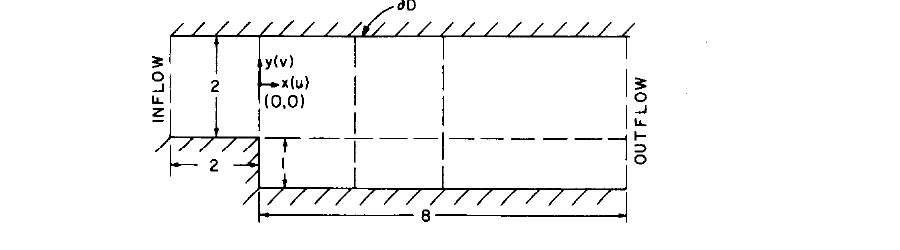

**Fig. 5.** Geometry of the one-sided channel expansion in nondimensional units (scaled with the channel half-width). The inflow boundary is $-2$ up from the step, and outflow is $L$ units down from the expansion. The particular computational domain depicted here is for the $R = 109.5$ case, where $L = 8$, and interfaces of the elements (dashed lines) are at $x = 0, 2,$ and $4$. The entire boundary of the computational domain (including inflow and outflow) is denoted $\partial D$.

The channel geometry is shown in Fig. 5. It is assumed that the channel length previous to the expansion is long, and the inflow profile is therefore taken to be parabolic. The steady separated flow is found by integrating the time-dependent Navier–Stokes equations until a steady situation is obtained; the equations to be numerically simulated are, therefore,

```
                  dv   lap(v)
                  ── = ────── - omega ~ v - grad Pi
                  dt     R

                              div v = 0
```
*(22a)*

```
                                  <2>
                                 v
                            Pi = ──── + p
                                  2

                           omega = curl(v)
```
*(22b)*

$\mathbf{v} = 0$ at solid walls; $\mathbf{v} = (1 - y^2)\hat x$ at inflow ($x=-2$); $\partial \mathbf{v}/\partial x = 0$ at outflow ($x=L$). &emsp; *(22c)*

```
                           v(x, 0) = v0(x)
```
*(22d)*

where $\Pi$ is the dynamic pressure, and $\boldsymbol{\omega}$ is the vorticity. Eqs. (22) are nondimensionalized with respect to the inlet channel half-width, $h$, and the maximum velocity at inflow, $U_0$ ($R = U_0 h / \nu$). The step-height is taken to be the same as the channel half-width, and the nondimensional length of the channel following the expansion is $L$. The inflow point is always taken to be two step-heights up from the step. Various initial conditions $\mathbf{v}^0$ were used; typically the flow everywhere was taken initially to be that at inflow (and zero for $y < -1$). Note that although only steady results are presented in this paper, the method described here is not only an iterative steady-state solver, but an accurate time-dependent scheme as well.

The time-stepping scheme used is based on the Green's function techniques developed for both spectral techniques [14–16] and finite element methods [17]. (Note the spectral element spatial discretization does not require the particular time-stepping procedure described below, nor vice versa. However, these spatial and temporal treatments are certainly compatible, and we therefore present them in a unified fashion.) Before beginning the simulation, the following Stokes problem is solved in a preprocessing stage:

```
                            lap(PiT ) = 0
                                   k

                         PiT (x ) = delta
                            k  j         k, j
```
*(23a)*

```
                     lap(vT )                vT
                           k                   k
                     ──────── - grad(PiT ) = ───
                        R               k    dt
```
*(23b)*

$\tilde{\mathbf v}_k = 0$ at solid walls; $\tilde{\mathbf v}_k = 0$ at inflow ($x=-2$); $\partial \tilde{\mathbf v}_k/\partial x = 0$ at outflow ($x=L$). &emsp; *(23c)*

where $\mathbf{x}_j$ ($j = 1, 2, \ldots, N_b$) represent the (numerical) grid points on the boundary $\partial D$, and $\delta_{kj}$ is the Kronecker-delta symbol. From the solution (23) we construct the capacitance matrix

```
                         G     = div(vT )(x )
                          i, j         j   i
```
*(24)*

The time-stepping procedure then consists of first solving the inhomogeneous problem

```
          vTI      - v    omega    ~ v      3 (omega  ~ v )
             n + 1    n        nm1    nm1           n    n
          ───────────── = ─────────────── - ───────────────
               dt                2                 2
```
*(25a)*

```
                                     div(vTI     )
                                            n + 1
                   lap(PiI     ) = - ─────────────
                          n + 1           dt
```
$\Pi_I^{n+1} = 0$ on $\partial D$. &emsp; *(25b)*

```
          lap(vI     )   vI                         vTI
                n + 1      n + 1                       n + 1
          ──────────── - ─────── = grad(PiI     ) - ────────
               R           dt              n + 1       dt
```
*(25c)*

$\mathbf v_I^{n+1} = 0$ at solid walls; $\mathbf v_I^{n+1} = (1 - y^2)\hat x$ at inflow ($x=-2$); $\partial \mathbf v_I^{n+1}/\partial x = 0$ at outflow ($x=L$). &emsp; *(25d)*

Note that no boundary conditions are imposed on $\Pi_I^{n+1}$. The solution is then constructed from $\tilde{\mathbf v}_k$ and $\mathbf v_I^{n+1}$,

```
                      v      = vI      + bb  vT
                       n + 1     n + 1     j   j
```
$\beta_j$ → `bb_j`. &emsp; *(26a)*

where the $\beta_j$ are determined from

```
                    G     bb  = - div vI     (x )
                     i, j   j           n + 1  i
```
*(26b)*

which is the requirement that continuity be satisfied on the domain boundary $\partial D$.

The scheme, as presented, has errors $O(\Delta t^2) + O(\Delta t / R)$ in time, for although the explicit Adams–Bashforth scheme is second-order, the backward-Euler implicit viscous step is first-order. The second-order Crank–Nicolson scheme could be easily substituted for the backward-Euler method at no cost in efficiency. (Note that, although (26) ensures that $\nabla\cdot\mathbf v^{n+1}$ satisfies a homogeneous equation and homogeneous boundary equations, there are nevertheless numerical commutation errors near the boundary. These have been shown to be small relative to the error estimate given above [15, 16].) The Green's function technique (23)–(26) is a viable alternative to splitting methods [18], particularly in situations (such as inflow–outflow) where there is motion at the boundaries.

We now discuss the spatial discretization. The element boundaries are shown in Fig. 5; within each element, $N_x^i$ and $N_y^i$ collocation points are used in the $x$ and $y$ directions, respectively. It is appropriate to comment here on the way in which we require the spectral element solution to converge. Clearly, the solution can converge either algebraically as $M \to \infty$ with fixed $N_x^i, N_y^i$, or exponentially as $N_x^i, N_y^i \to \infty$ with fixed $M$ ($h$- or $p$-convergence, respectively); in general, we choose the latter path. However, the spectral element strategy should not be perceived as selecting extremely high-order expansions in the largest elements compatible with a given geometry. Rather, element boundaries are chosen to provide optimal convergence of low-order spectral (but high-order finite element) expansions. Indeed, the fact that most "well-behaved" functions (e.g., one period of a sine wave) are resolved to several digits by six or seven Chebyshev polynomials indicates that a well-formulated spectral element problem (i.e., one that is not overly global at the expense of a great loss in efficiency) should not require an excessive number of collocation points per element.

The nonlinear step (25a) is evaluated using collocation exactly as in the wave equation and the advection–diffusion equation of Section 1. For simplicity, we have chosen the two-dimensional analog of $\alpha^- = \tfrac{1}{2}, \alpha^+ = \tfrac{1}{2}$ in (11); to wit, the derivative at an element boundary point is taken as the average of the derivatives (at that point) evaluated in the elements surrounding it. This algorithm is easily implemented and vectorizable.

The implicit equations to be solved, (23), (25b), (25c), are treated as the Helmholtz equation of Subsection 1.3. The elements are rectilinear in $(x, y)$, and therefore the elemental equations can be constructed for a single element and appropriately scaled to represent any other element. In two dimensions, the Lagrangian interpolant of a variable $u(x, y)$ is written in the $i$th element (of dimension $L_x^i$ by $L_y^i$) as

```
                           Nx           Ny
                          ____         ____
                          ╲            ╲
             u (xb, yb) =  ⟩    h (xb)  ⟩    u     h (yb)
              i           ╱      j     ╱      j, k  k
                          ‾‾‾‾         ‾‾‾‾
                          j = 0        k = 0
```
*(27)*

where the $h_j$ are defined in (4)–(6). For the two-dimensional Helmholtz equation

```
                                         2
                        lap(u) - u lambda  = f
```
*(28a)*

and corresponding functional

```
                         ⌠⌠     2       2          2
                         ⎮⎮    u  lambda    |grad u|
              I = sum_i  ⎮⎮ (- ────────── - ───────── - f u) dx dy
                         ⎮⎮        2            2
                         ⌡⌡
```
*(28b)*

the elemental equations are

```
                C           u     = B           f
                 j, k, l, m  l, m    j, k, l, m  l, m
```
*(29a)*

```
                                                         2
           C           = A           - B           lambda
            j, k, l, m    j, k, l, m    j, k, l, m
```
*(29b)*

Here

```
                          Ly a     b       Lx b     a
                              j, l  k, m       j, l  k, m
            A           = ────────────── + ──────────────
             j, k, l, m         Lx               Ly
```
*(30a)*

```
                                 Lx Ly b     b
                                        j, l  k, m
                   B           = ─────────────────
                    j, k, l, m           4
```
*(30b)*

and $A_{jl}^i$, $B_{jl}^i$ are defined in (15). The system matrix is then constructed by the direct stiffness method. Note that the only boundary conditions required in (23)–(25) are Dirichlet (implemented by matrix condensation) and zero-derivative (natural) boundary conditions.

The system matrices have been inverted using unpivoted, symmetric, banded, skyline Gaussian elimination. No conditioning problems were encountered. A much more efficient matrix-inversion procedure is currently being implemented using the static condensation algorithm [4], which is particularly appropriate for higher-order methods given the large number of internal degrees of freedom. The static condensation algorithm is amenable to both vectorization and parallel processing.

We note one subtlety associated with the solution procedure (23)–(26); corners where the no-slip boundary conditions automatically imply a divergence-free velocity field (e.g., $(-2, 1)$, $(-2, -1)$, $(0, -2)$ in Fig. 5) create zero rows in the capacitance matrix $G_{ij}$. It can be shown that, corresponding to these zero rows, there are pressure eigenfunctions peaked at the corners in question (in fact, for a finite difference scheme rather than a finite element scheme these eigenfunctions are simple discrete delta functions). This indeterminacy, which is a result of any discretization, is properly alleviated by dictating the pressure at these corners, in addition to the usual condition of imposing the overall pressure level.

Our treatment of the outflow boundary is far from satisfactory. On occasion, during the transient response, fluid entered the outflow boundary with subsequent instability. For the purposes of achieving a steady-state, this phenomenon was eliminated by imposing the fully developed Poiseuille flow pressure gradient at outflow rather than imposing the divergence condition (26b). Although the pressure-gradient condition is still relatively weak, care must be taken to make $L$ sufficiently large that the phenomena of interest are not affected by the outflow treatment.

### 2.2. Computed Flow Patterns

We restrict ourselves here to laminar, two-dimensional, moderate Reynolds number flow (i.e., $R \sim 50$–$250$). There are several points on which comparisons can be made with previous numerical work and experiment. The position of the center of the separated vortex, the volume flowrate within the vortex, the point of flow reattachment, and the streamwise velocity profiles at various points downstream of the step are all quantities that have been measured with some accuracy.

Our basic test case (the one for which Fig. 5 is drawn) is $R = 109.5$, corresponding to the $\bar R = 73$ (based on inlet mean velocity and inlet half-width) experiment performed in [12]. The simulation parameters used are $N_x^i = 5$, $N_y^i = 6$, for all elements. In general, for $R \gtrsim 100$, it is found experimentally that the normalized recirculating volume flowrate in the vortex (i.e., the minimum of the streamfunction assuming the lower and upper walls are at $\psi = 0$ and $\psi = 1$, respectively) is approximately $-0.023$, and that the streamfunction attains this minimum at $x_m / L_r = 0.3$, $y_m = -1.4$, where $L_r$ is the nondimensionalized reattachment length. Numerical work using upwind differencing [12] agrees with the experimental data. Using the numerical methods discussed in Subsection 2.1, we find that, at $R = 109.5$, the streamfunction minimum is $-0.021$, and that this minimum is attained (at the "center" of the vortex) at $x_m / L_r = 0.32$, $y_m = -1.4$.

To find the reattachment point, we plot streamfunction contours in Fig. 6. The value of $L_r$ is seen to be $\approx 5.0$. This figure is slightly larger than the experimental value, but in good agreement with the value obtained using finite differences [12]. In Fig. 7 we plot the streamwise velocity profiles at several locations downstream of the step. The agreement with experiment is good.

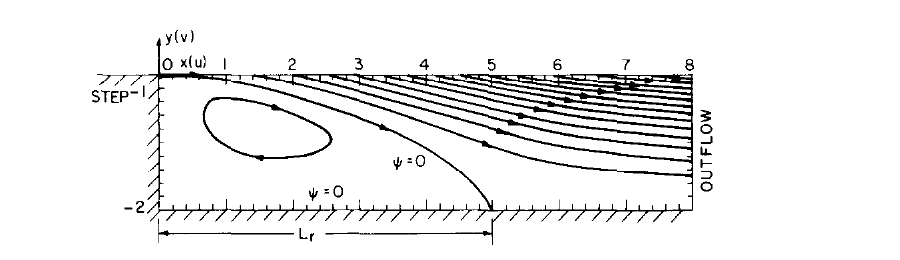

**Fig. 6.** Contours of the streamfunction for the calculated steady separated flow at $R = 109.5$. We plot here only the region "below" the step ($y \le -1$, and $x > 0$). The reattachment point is $L_r \approx 5.0$.

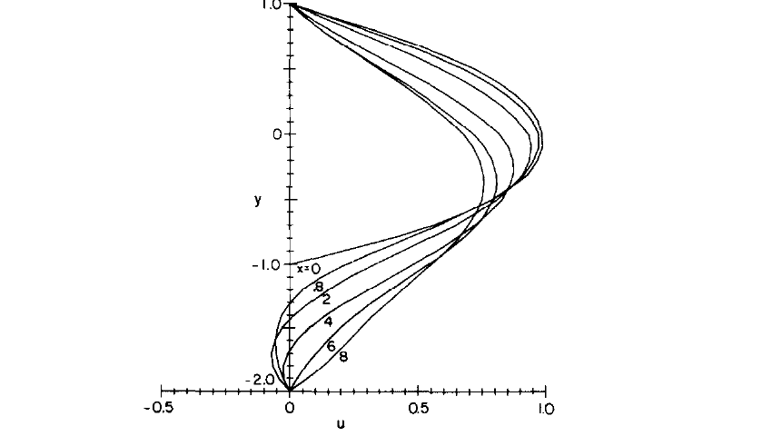

**Fig. 7.** Streamwise velocity profiles of the calculated steady separated flow at $R = 109.5$. Although quantitative comparisons are difficult, the calculated profiles appear to be very similar to the experimental curves in [12].

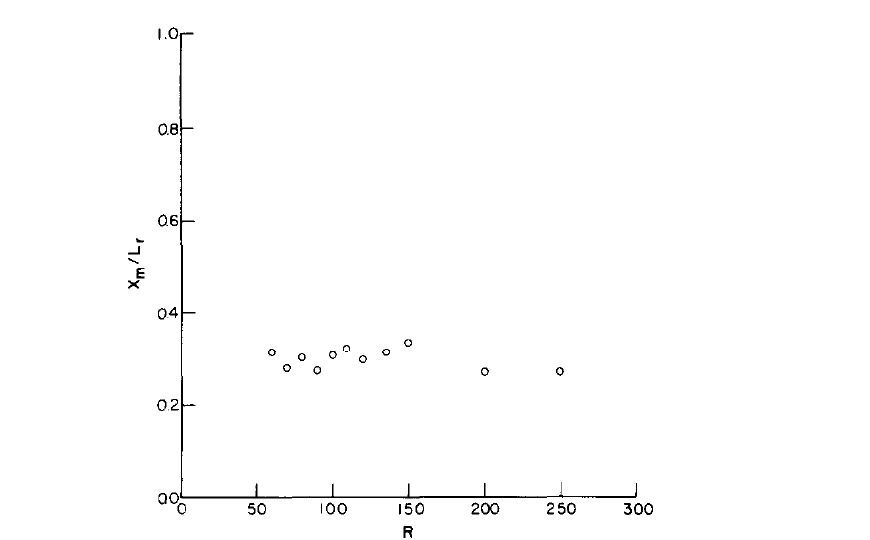

**Fig. 8.** A plot of the normalized $x$ position of the vortex center, $x_m / L_r$, as a function of Reynolds number. Invariance in reattachment coordinates is observed for sufficiently large Reynolds number.

As the Reynolds number is varied from our base calculation of $R = 109.5$, the simulations continue to agree with previous work on the vortex location and strength, as well as on streamline contours and velocity profiles. As in [12], the vortex region is found to be Reynolds-number invariant when appropriately scaled in the $x$ direction with the reattachment length. In Fig. 8 we plot the location of the streamfunction minimum (normalized with respect to reattachment length) as a function of the Reynolds number. In Fig. 9 the variation of the recirculating volume flowrate with Reynolds number is shown. Note that as the Reynolds number increases, $L$ (the computational domain length) and the resolution ($N_x^i, N_y^i$) are also increased; the results presented are converged in all these quantities. At $R = 250$, $N_x^i = 6$, $N_y^i = 6$, and $L = 15$.

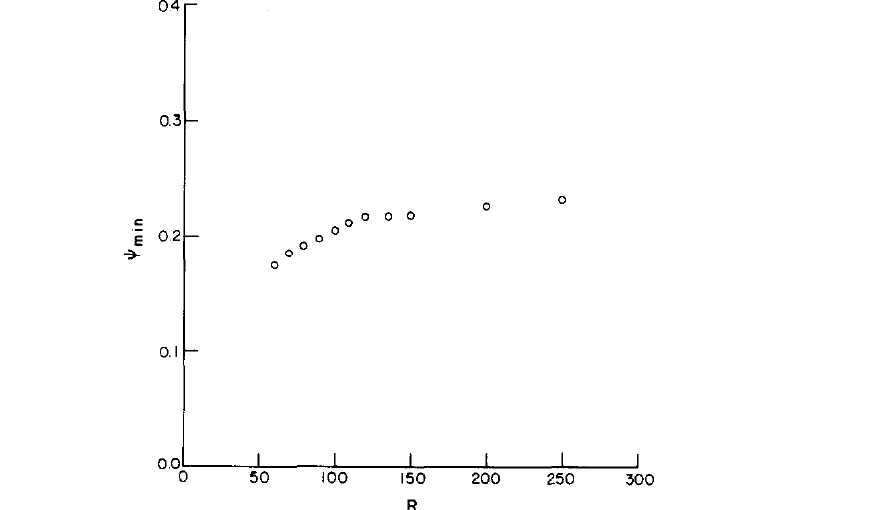

**Fig. 9.** A plot of the volume flow rate, $\psi_{\min}$, as a function of Reynolds number. As previously determined [12], the flowrate in the vortex is insensitive to viscosity for "high" Reynolds number flow that is maintained two-dimensional.

The results for the reattachment length as a function of Reynolds number are plotted in Fig. 10. Although in agreement with previous numerical work, we predict reattachment lengths significantly larger than those found in the experiments of [12]. This discrepancy, which has been reported in other numerical studies [13, 19], is generally attributed to insufficient entrance length in the experimental apparatus and, hence, not fully developed inlet profiles. The slight difference in the spectral element and upwind [12] predictions at $R = 250$ is probably due to numerical diffusion in the latter scheme.

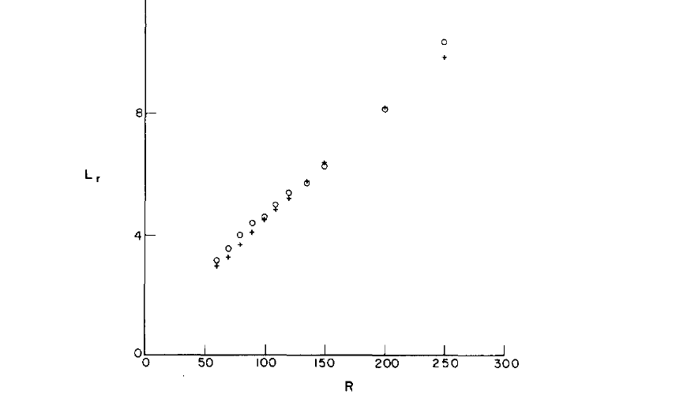

**Fig. 10.** A plot of the reattachment length of the flow versus Reynolds number. Our results ($\circ$) are in good agreement with previous numerical calculations [12] ($+$). Agreement with experiment is good except when insufficient entrance length results in experimental inlet profiles that are not fully developed.

In order to determine the validity of the spectral element method in a situation where accord between numerical and experimental results has been previously established, we compare in Table I the spectral element predictions for $L_r$ for a 1:2 channel expansion with the experimental and numerical results of [13]. Here the Reynolds number is based on maximum inlet velocity and full inlet width (which is the same as step height). The agreement is seen to be good.

**Table I.** Comparison of Spectral Element Predictions of Reattachment Length for 1:2 Channel Expansion with Experiment [13]

| $R$ | $L_r$ (Spectral Element) | $L_r$ (Numerical/Experimental [13]) |
|-----|--------------------------|--------------------------------------|
| 15  | 2.9                      | 3.0                                  |
| 225 | 6.8                      | 6.7                                  |

Although the spectral element method requires many fewer degrees-of-freedom than low-order methods (e.g., [12, 13]) to simulate step flow, the problem is unfortunately not ideal for determining the resolution properties of a numerical scheme. In particular, the large reattachment length at high Reynolds numbers results in a boundary-layer scaling and, consequently, the numerical diffusion due to low-order methods (e.g., upwinding) is greatly reduced.

The major limitations of the spectral element method as presented in this paper are due to inefficiency of the matrix inversions, and restriction to rectilinear elements. These deficiencies are currently being addressed, the former by implementation of static condensation, the latter by construction of sub- and isoparametric spectral elements. Problems being addressed with this more general formulation include oscillatory flow in grooves, and three-dimensional spatial stability and transition in general curved channels and boundary layers. The results of these calculations will be reported in a future paper.

---

## Acknowledgments

I would like to thank Ms. Nesreen Ghaddar for her help in constructing the channel computer code and in performing the numerical calculations. I would also like to acknowledge K.-J. Bathe, M. O. Deville, D. I. Meiron, and S. A. Orszag for helpful discussions and comments concerning this work. This work was supported by National Science Foundation Grant MEA-8212469 and by NASA Grant NAS1-16977. The computations were performed at the Computing Facility of the National Center for Atmospheric Research which is supported by the National Science Foundation.

---

## References

1. D. O. Gottlieb and S. A. Orszag, *Numerical Analysis of Spectral Methods: Theory and Applications*, NSF–CBMS Monograph No. 26, Soc. Indus. Appl. Math., Philadelphia, 1977.
2. H. Deconinck and C. Hirsch, in *Proceedings of 7th International Conference on Numerical Methods in Fluid Dynamics* (W. C. Reynolds and R. W. MacCormack, Eds.), p. 138, Springer-Verlag, New York/Berlin, 1980.
3. K.-J. Bathe and V. Sonnad, in *Proceedings of AIAA Computers and Fluid Dynamics Conf., Palo Alto, California*, 1981.
4. A. J. Baker, *Finite Element Computational Fluid Mechanics*, Hemisphere, Washington, D. C., 1983.
5. R. Glowinski, J. Periaux, and Q. V. Dinh, *Domain Decomposition Methods for Nonlinear Problems in Fluid Dynamics*, INRIA Research Report No. 147, 1982.
6. B. Metivet and Y. Morchoisne, in *Proceedings of 4th GAMM Conference on Numerical Methods in Fluid Mechanics, Paris*, 1981.
7. L. M. Delves and C. A. Hall, *J. Inst. Math. Appl.* **23** (1979), 223.
8. L. M. Delves and C. Phillips, *J. Inst. Math. Appl.* **25** (1980), 177.
9. A. Hajj, L. M. Delves, and C. Phillips, *Internat. J. Numer. Methods Engrg.* **15** (1980), 167.
10. A. McKerrell, C. Phillips, and L. M. Delves, *J. Comput. Phys.* **40** (1981), 444.
11. E. O. Macagno and T.-K. Hung, *J. Fluid Mech.* **28** (1967), 43.
12. M. K. Denham and M. A. Patrick, *Trans. Inst. Chem. Engrs.* **52** (1974), 361.
13. B. F. Armaly, F. Durst, J. C. F. Pereira, and B. Schönung, *J. Fluid Mech.* **127** (1983), 473.
14. L. Kleiser, in *Proceedings of Institute for Computer Applications in Science and Engineering Symposium on Spectral Methods for Partial Differential Equations*, Soc. Indus. Appl. Math., Philadelphia, 1982.
15. P. S. Marcus, S. A. Orszag, and A. T. Patera, in *Proceedings of 8th International Conference on Numerical Methods in Fluid Dynamics* (E. Krause, Ed.), p. 371, Springer-Verlag, New York/Berlin, 1982.
16. P. S. Marcus, *J. Fluid Mech.*, in press.
17. R. Glowinski and O. Pironneau, *Numer. Math.* **33** (1979), 397.
18. M. O. Deville and S. A. Orszag, *J. Comput. Phys.*, in press.
19. M. A. Leschziner, *Comput. Meth. Appl. Mech. Engrg.* **23** (1980), 293.
